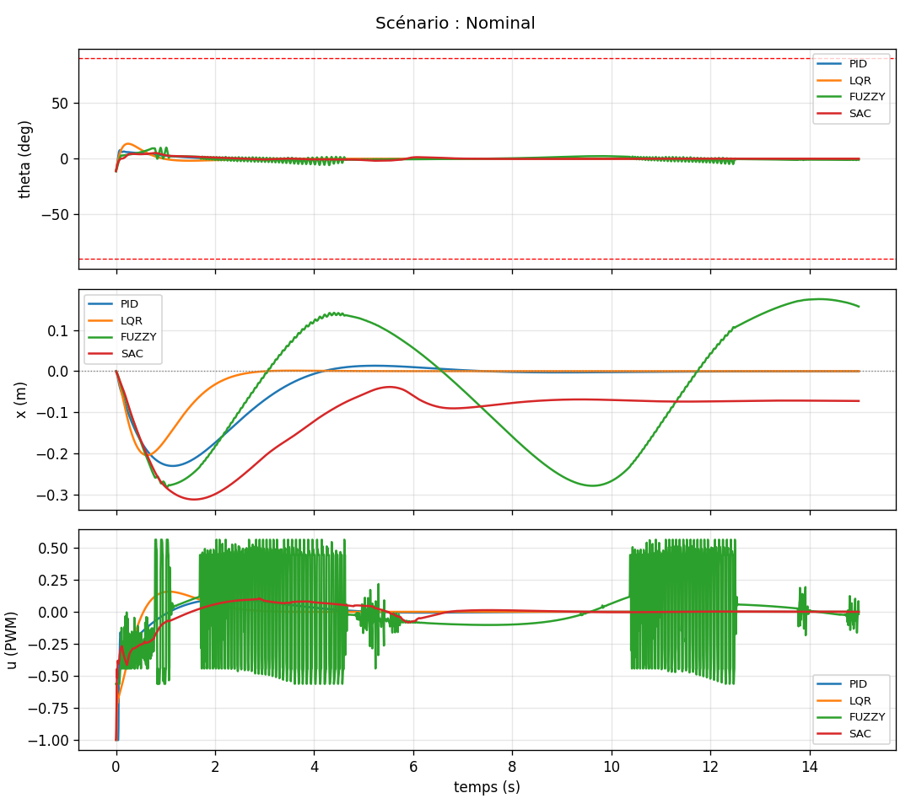
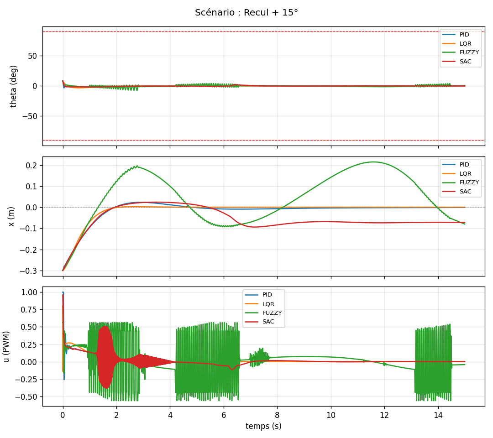
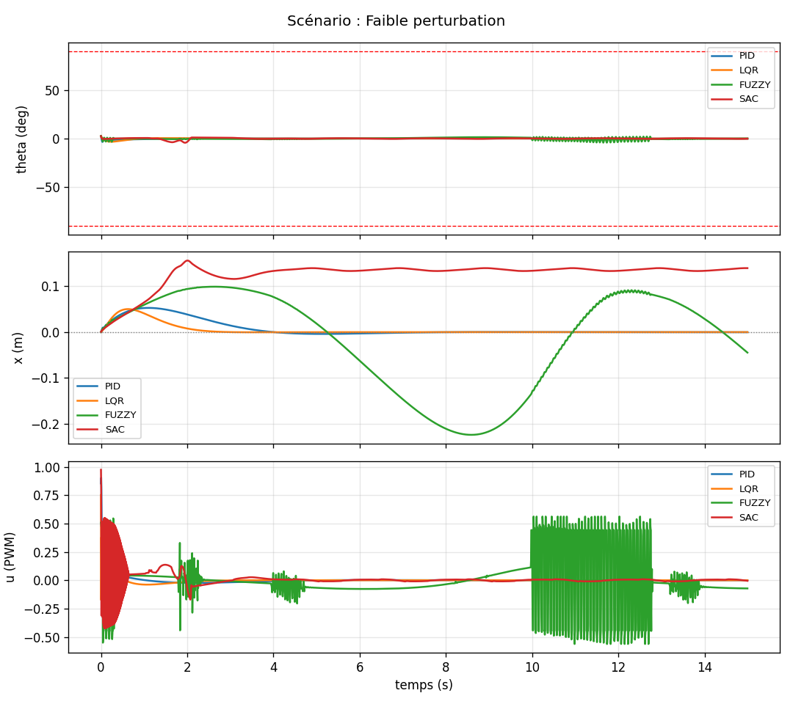
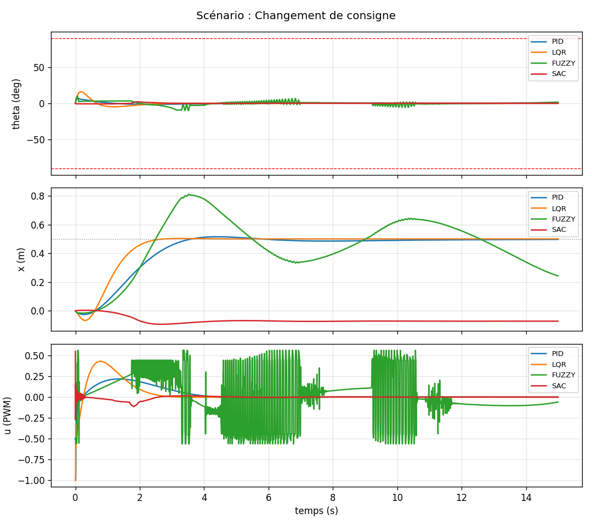
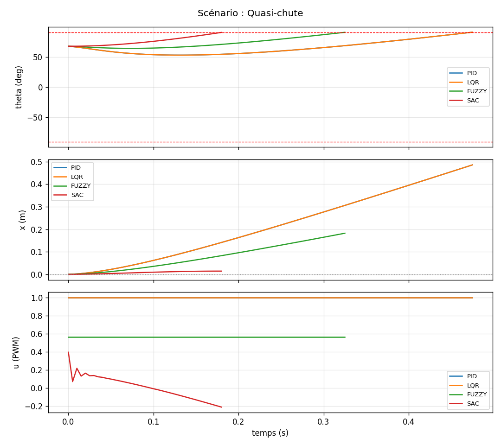
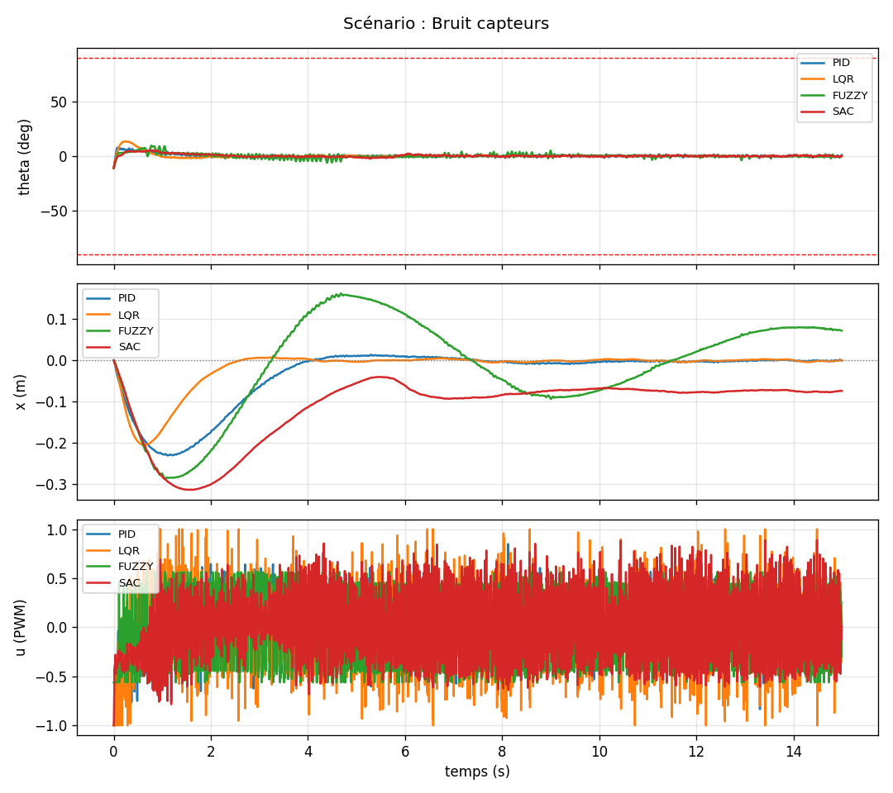
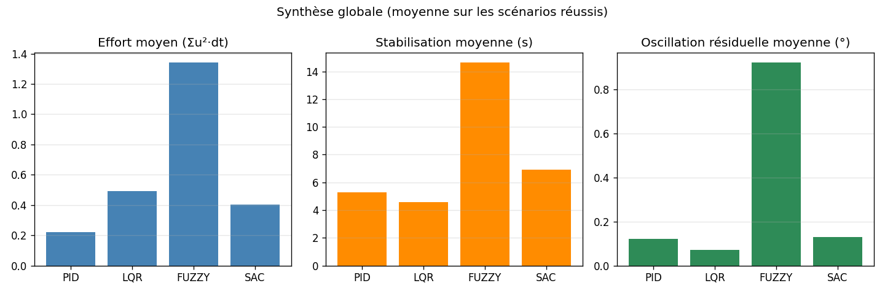

# Rapport de benchmark — Pendule inversé sur chariot

Généré le 2026-08-12 12:20:06 par `benchmark.py`.

## Méthodologie

- Pas de simulation : `dt = 0.005` s (200 Hz), intégration RK4 (`robot.py`)
- Durée simulée par scénario : 15.0 s
- Échec si |theta| > 90.0° (chute) ou |x| > 1.5 m (dérive)
- Stabilisé si |theta| < 0.57° et |x - consigne| < 0.05 m
- Commande : rapport cyclique PWM ∈ [-1, 1] (modèle moteur CC avec force contre-électromotrice, `motor.py`)
- Effort = Σ u²·dt (proxy d'énergie de commande)
- Temps de calcul : mesuré en Python sur cette machine — indicatif, comparatif entre contrôleurs uniquement
- Bruit capteurs (scénario dédié) : écarts-types gaussiens ajoutés à la mesure transmise au contrôleur (état physique inchangé) — x: 1.0 mm, dx: 2.0 cm/s, theta: 0.50°, dtheta: 0.050 rad/s ; même tirage (seed=42) pour tous les contrôleurs

Contrôleurs demandés : PID, LQR, FUZZY, SAC

## Scénario : Nominal

Léger déséquilibre initial (-0.20 rad), consigne à l'origine.

| Contrôleur | Statut | t_fin (s) | \|x\|max (m) | x_fin (m) | theta_fin (°) | osc_theta (°) | overshoot_theta (°) | stabil._theta (s) | stabil._x (s) | effort | calcul (µs) |
|---|---|---|---|---|---|---|---|---|---|---|---|
| PID | OK | 15.00 | 0.231 | -0.000 | +0.00 | 0.002 | 11.05 | 3.935 | 3.245 | 0.107 | 14.44 |
| LQR | OK | 15.00 | 0.204 | +0.000 | -0.00 | 0.000 | 13.52 | 2.500 | 1.795 | 0.121 | 2.63 |
| FUZZY | OK | 15.00 | 0.283 | +0.157 | -0.97 | 0.943 | 11.24 | 15.000 | 15.000 | 1.227 | 39.56 |
| SAC | OK | 15.00 | 0.312 | -0.072 | +0.01 | 0.021 | 11.06 | 6.705 | 15.000 | 0.106 | 256.44 |

## Scénario : Recul + 15°

Chariot reculé de 30 cm avec le pendule penché à 15°.

| Contrôleur | Statut | t_fin (s) | \|x\|max (m) | x_fin (m) | theta_fin (°) | osc_theta (°) | overshoot_theta (°) | stabil._theta (s) | stabil._x (s) | effort | calcul (µs) |
|---|---|---|---|---|---|---|---|---|---|---|---|
| PID | OK | 15.00 | 0.300 | -0.001 | -0.00 | 0.000 | 8.18 | 2.495 | 1.350 | 0.073 | 15.73 |
| LQR | OK | 15.00 | 0.300 | +0.000 | +0.00 | 0.000 | 8.27 | 1.875 | 1.150 | 0.056 | 2.91 |
| FUZZY | OK | 15.00 | 0.300 | -0.080 | +0.33 | 1.269 | 8.37 | 14.475 | 15.000 | 1.260 | 39.44 |
| SAC | OK | 15.00 | 0.300 | -0.072 | +0.01 | 0.029 | 8.20 | 7.110 | 15.000 | 0.150 | 260.78 |

## Scénario : Faible perturbation

Angle initial faible (+5°) : cas facile de référence.

| Contrôleur | Statut | t_fin (s) | \|x\|max (m) | x_fin (m) | theta_fin (°) | osc_theta (°) | overshoot_theta (°) | stabil._theta (s) | stabil._x (s) | effort | calcul (µs) |
|---|---|---|---|---|---|---|---|---|---|---|---|
| PID | OK | 15.00 | 0.053 | -0.000 | -0.00 | 0.000 | 3.53 | 1.045 | 1.460 | 0.019 | 16.83 |
| LQR | OK | 15.00 | 0.050 | -0.000 | +0.00 | 0.000 | 3.31 | 0.780 | 0.680 | 0.010 | 2.91 |
| FUZZY | OK | 15.00 | 0.224 | -0.045 | -0.04 | 1.188 | 4.28 | 13.730 | 13.650 | 0.666 | 42.23 |
| SAC | OK | 15.00 | 0.156 | +0.140 | -0.22 | 0.214 | 4.34 | 3.135 | 15.000 | 0.110 | 254.13 |

## Scénario : Changement de consigne

Départ à l'équilibre, consigne de position déplacée à 0.5 m.

| Contrôleur | Statut | t_fin (s) | \|x\|max (m) | x_fin (m) | theta_fin (°) | osc_theta (°) | overshoot_theta (°) | stabil._theta (s) | stabil._x (s) | effort | calcul (µs) |
|---|---|---|---|---|---|---|---|---|---|---|---|
| PID | OK | 15.00 | 0.515 | +0.497 | -0.00 | 0.003 | 8.18 | 4.000 | 2.930 | 0.101 | 16.77 |
| LQR | OK | 15.00 | 0.503 | +0.500 | -0.00 | 0.000 | 16.00 | 2.680 | 1.945 | 0.191 | 2.89 |
| FUZZY | OK | 15.00 | 0.811 | +0.243 | +1.67 | 0.629 | 10.22 | 15.000 | 15.000 | 1.207 | 41.44 |
| SAC | OK | 15.00 | 0.094 | -0.072 | +0.00 | 0.005 | 2.10 | 2.600 | 15.000 | 0.008 | 259.00 |

## Scénario : Quasi-chute

Angle initial proche du seuil de chute (75% de CHUTE_THETA_MAX) : robustesse en cas extrême.

| Contrôleur | Statut | t_fin (s) | \|x\|max (m) | x_fin (m) | theta_fin (°) | osc_theta (°) | overshoot_theta (°) | stabil._theta (s) | stabil._x (s) | effort | calcul (µs) |
|---|---|---|---|---|---|---|---|---|---|---|---|
| PID | ÉCHEC (chute) | 0.48 | 0.486 | +0.486 | +90.61 | 5.276 | 90.61 | — | — | 0.480 | 16.62 |
| LQR | ÉCHEC (chute) | 0.48 | 0.486 | +0.486 | +90.61 | 5.276 | 90.61 | — | — | 0.480 | 2.73 |
| FUZZY | ÉCHEC (chute) | 0.33 | 0.183 | +0.183 | +90.40 | 3.640 | 90.40 | — | — | 0.104 | 40.27 |
| SAC | ÉCHEC (chute) | 0.18 | 0.015 | +0.015 | +90.25 | 2.840 | 90.25 | — | — | 0.003 | 323.66 |

## Scénario : Bruit capteurs

Même état nominal que le premier scénario, mais les contrôleurs ne reçoivent qu'une mesure bruitée de l'état (imperfection des encodeurs et du gyro/IMU) au lieu de l'état exact simulé.

| Contrôleur | Statut | t_fin (s) | \|x\|max (m) | x_fin (m) | theta_fin (°) | osc_theta (°) | overshoot_theta (°) | stabil._theta (s) | stabil._x (s) | effort | calcul (µs) |
|---|---|---|---|---|---|---|---|---|---|---|---|
| PID | OK | 15.00 | 0.230 | -0.000 | +0.98 | 0.603 | 11.05 | 15.000 | 3.150 | 0.810 | 19.79 |
| LQR | OK | 15.00 | 0.205 | +0.000 | -0.28 | 0.354 | 13.53 | 14.970 | 1.785 | 2.091 | 3.50 |
| FUZZY | OK | 15.00 | 0.287 | +0.072 | -0.18 | 0.586 | 11.24 | 14.965 | 15.000 | 2.345 | 44.28 |
| SAC | OK | 15.00 | 0.313 | -0.074 | +0.17 | 0.380 | 11.06 | 14.970 | 15.000 | 1.646 | 279.64 |

## Synthèse globale

Moyennes calculées uniquement sur les scénarios réussis (sans chute ni dérive).

| Contrôleur | Scénarios réussis | effort moyen | stabil._theta moyen (s) | osc_theta moyenne (°) | calcul moyen (µs) |
|---|---|---|---|---|---|
| PID | 5/6 | 0.222 | 5.29 | 0.122 | 16.71 |
| LQR | 5/6 | 0.494 | 4.56 | 0.071 | 2.97 |
| FUZZY | 5/6 | 1.341 | 14.63 | 0.923 | 41.39 |
| SAC | 5/6 | 0.404 | 6.90 | 0.130 | 262.00 |
